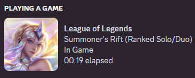
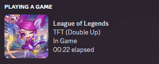

<mark><b>Annoucement: DetailedLoLRPC has been tested on PBE and worked just fine with Vanguard.</b></mark>

<!-- PROJECT LOGO -->
 

  
<h3 align="center">DetailedLoLRPC</h3>

  

    A better Discord Rich Presence for League of Legends.
     
    <a href="https://github.com/developers192/DetailedLoLRPC/issues">Report Bug</a>
    ·
    <a href="https://github.com/developers192/DetailedLoLRPC/issues">Request Feature</a>
  

<!-- ABOUT THE PROJECT -->
## About The Project

  
  

This project was created as a replacement for League of Legends' outdated Discord Rich Presence.

## Features
- Display your current skin instead of default splash arts
- Updated splash arts for outdated ones
- Proper splash arts for newer champions
- More detailed mode texts (Ranked Solo/Duo/Flex, TFT Double Up, ...)

And many more ...

<!-- GETTING STARTED -->
## Getting Started

To start using DetailedLoLRPC, follow these steps:

### Prerequisites

- Windows 7 and above
- League of Legends
- Discord

### Installation & Usage

1. Download the latest [Release](https://github.com/developers192/DetailedLoLRPC/releases/latest) (It might be flagged by your antivirus, whitelist it if that's the case)
2. Make sure LoL is not running. Run `DetailedLoLRPC.exe`
3. If the Riot Client is not running, you'll have to manually specify the required path.
4. League of Legends will now automatically run with its Rich Presence replaced with DetailedLoLRPC.

<!-- USAGE EXAMPLES -->
## Options

You can right click the tray icon to toggle various settings:
- "Use skin's splash and name": Display the current skin's splash and name on Discord. If disabled, default skin and champion name will be used instead.
- "Show "View splash art" button": Display a button on Discord that allows viewing the current skin's splash.
- "Idle status": Choose an idling status to show on Discord (If this doesn't update first try, you can try creating and leaving a lobby)
- "Reset preferences": Reset all settings to their default values. You have to use this if you want to move your Riot Games folder to another directory.
- "Report bug": Open the the page to report a bug and the folder containing the necessary logs.
- "Exit": Exit DetailedLoLRPC (LoL's native RPC will not be re-enabled until the next time you start LoL using the Riot Client)

If you change any settings while in the middle of a game, they will be applied the next time you start a game.

<!-- Resource Usage -->
## Resource Usage
CPU usage is ~0%. Memory usage is ~50MB.

When first running, CPU usage could spike up to 25% for a few seconds 

<!-- To do -->
## To do

- [ ] Join lobby button on Discord

<!-- LICENSE -->
## License

Distributed under the MIT License. See `LICENSE` for more information.

## Disclaimer
- I will not hold responsibility for any bans caused by DetailedLoLRPC. (In theory it won't happen because DetailedLoLRPC only uses the API provided by the Client itself. Although it does tamper with the `plugin-manifest.json` file to disable the native RPC, I think it's [fine](https://www.reddit.com/r/leagueoflegends/comments/awedjv/there_is_a_way_to_make_the_client/))
- DetailedLoLRPC is not endorsed by Riot Games and does not reflect the views or opinions of Riot Games or anyone officially involved in producing or managing Riot Games properties. Riot Games and all associated properties are trademarks or registered trademarks of Riot Games, Inc.

(<a href="#readme-top">back to top</a>)
